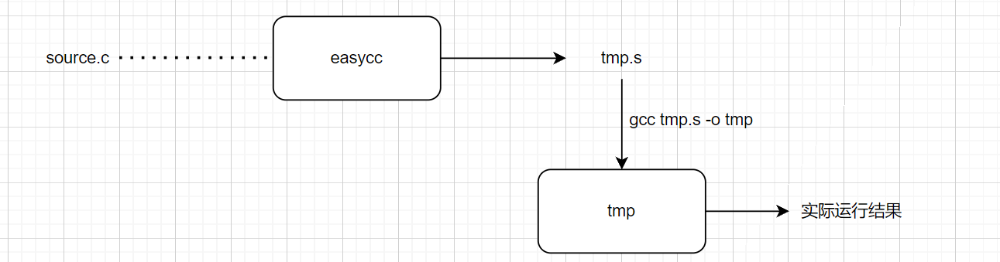
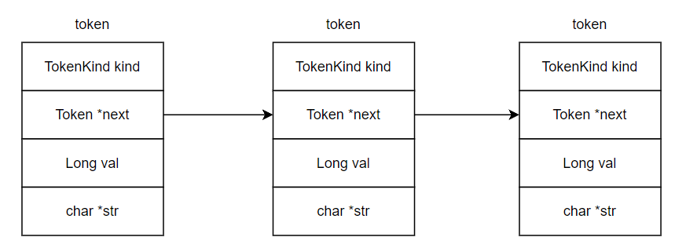

EasyCC

一个简单的C语言编译器，完全仿照chibicc。先把这个实现完了，然后再自己用c++或c来造一个简单的脚本语言！

## 001

```
支持语句: 1+3-1
```

本应该是读取.c文件，然后将其翻译成.s文件，再编译汇编代码。但是嘛，先跑起来再说，先采用直接在程序内部写汇编的方式。



## 002

概念补充：

1. tokenizer：词法分析中的词素生成器，负责将源码编程token
2. parser：处理词素，将词素组合成一个能够描述源码各个部分之间关系的中间形式-> AST 抽象语法树

